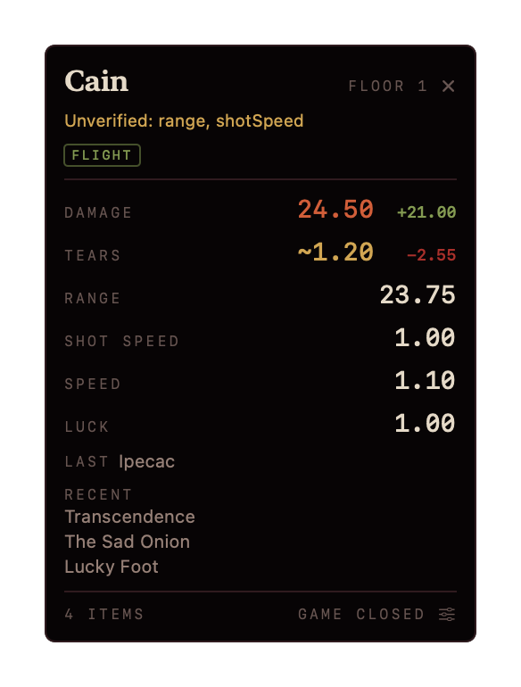
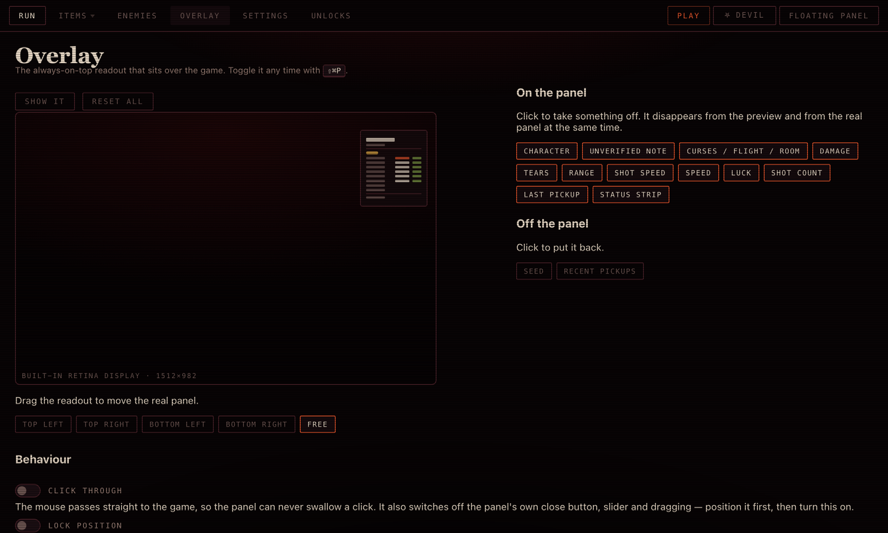
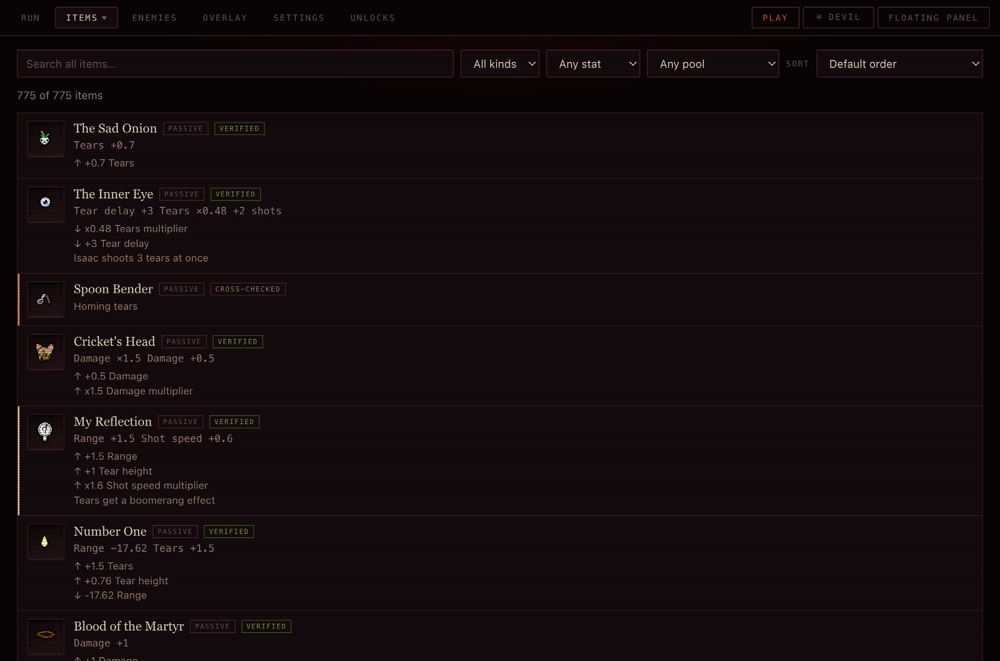
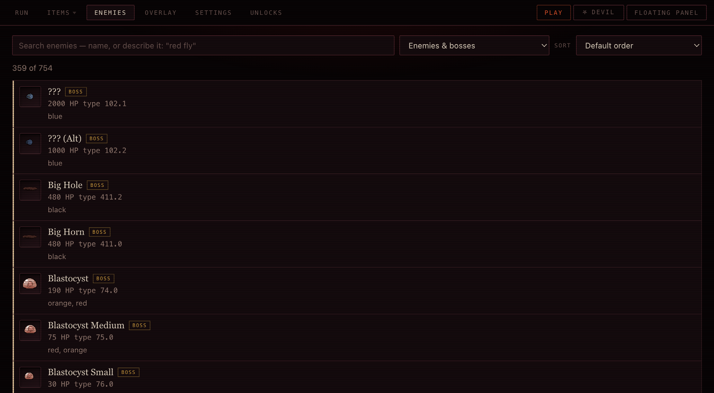
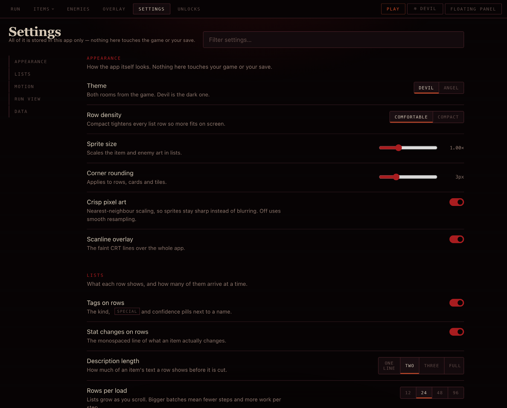

<div align="center">


# Isaac Companion

**Know what you just picked up.**

A live stat readout for *The Binding of Isaac: Afterbirth+* — it reads the game's own
log while you play and tells you what your damage and fire rate **actually are**.

[](LICENSE)
[](#install)
[](#the-windows-build)
[](#the-windows-build)
[](https://github.com/6gx42o/isaac-companion/actions/workflows/ci.yml)
[](https://github.com/6gx42o/isaac-companion/releases)
[](#no-mod-required)



</div>

---

Isaac never shows you your real numbers. A wiki tells you Sad Onion is `+0.7 tears`; it
cannot tell you what your tears per second are after the curve, the floor and the three
other things you are carrying. This does that, live, while you play.

It also tells you the thing you actually want to know at a pedestal: **what did the item
I just took change?** The overlay above is a real run — Ipecac landed, and it is showing
`+21.00` damage and `−2.55` tears against the item's name.

## No mod required

Enabling any Workshop mod in Afterbirth+ **disables Steam achievements**. So this is
fully external: it tails a log file the game already writes, reads the game's own
unpacked resources, and never writes anything back. No Lua runs, nothing is installed
into Isaac, and your trophies keep counting.

## Install

Grab a build from **[the download page](https://claude.ai/code/artifact/5d9c3018-7a5c-4216-96b8-54ae83aea5b6)**,
or build it yourself — see [Building](#building).

| | |
|---|---|
| **macOS** | `.dmg`, `.pkg` or `.zip` — one universal binary, Apple Silicon *and* Intel. macOS 14+. |
| **Windows** | a single `.exe`, no installer and no runtime. |
| **Linux** | a single x86-64 binary. `chmod +x` and run it. |

### Opening it the first time

The macOS build is signed with a self-signed certificate rather than a paid Apple
Developer ID, so macOS asks you to confirm the first launch:

> **Right-click the app in Applications and choose Open**, then click **Open** again.

Once. Every launch after that is a normal double-click. The same dialog appears for
any small independent app that has not paid Apple's yearly fee.

If you would rather do it from a terminal, this is the equivalent:

```sh
xattr -dr com.apple.quarantine /Applications/IsaacCompanion.app
```

## What it does

### The overlay



A borderless always-on-top panel over the fullscreen game, with its own tab for
configuring it: a **live mini-screen of your actual display** showing the panel where it
really is. Drag the miniature and the real window moves. Click a part of the readout to
take it off.

Around 35 settings — click-through (the mouse passes straight to the game), corner
snapping, per-display placement, opacity, text scale, compact mode, accent stat — and it
shows itself when Isaac launches and hides when you quit.

### The browser



Every item, card, pill and trinket, searchable by name, by effect, or **by colour
measured off the sprite itself** — so "grey" or "gold" finds the one you half-remember.
Each row shows what it really changes and how confident the data is.



359 enemies and bosses with HP, and 403 achievements with their unlock conditions.
Enemy icons play the idle loop out of their own animation files; pills cycle every
colour the game deals.

### Settings



Twenty-one of them, in five groups, with a filter over the top. Theme, row density,
sprite size, corner rounding, pixel-art scaling, what each row shows, how many rows
load at a time, four independent motion switches, decimal places, and the storage
mode. Every one is wired to something real — none of them are decorative.

### Pills and cards in the pocket slot

The log announces that a pocket item was used but never which one, and by the time
it does the slot is already empty. So the slot is read from the screen on a trigger
and the use is attributed to whatever was last seen there.

A **card** is named outright — its face is its identity and the game never
reshuffles it. A **pill** is harder: the game reshuffles which colour carries which
effect every run and writes it down nowhere reachable. Say what one did once and
every later pill of that colour is counted automatically, with any taken before you
named it backfilled.

Blank Rune and Black Rune ship no art that separates them, so those are reported as
a pair rather than guessed, and never entered into a run.

### Checking the numbers against the game

The whole app rests on seven numbers being right, and they came from a mod's data
files. Turn on the comparison table, type what the in-game HUD shows, and anything
that disagrees is a bug in the stat model rather than in your reading of it.

It found three of Cain's six base stats wrong on the first try — including two that
were not flagged as uncertain.

At the start of a run, before any item, the HUD **is** the character's baseline, so
those numbers can be saved as that character's measured base stats. Play a character
once and its row is settled from the game itself rather than from a wiki.

### The room advisor

In a Devil, Treasure or Angel room it reads the pedestals off the screen — passively,
via ScreenCaptureKit, with no injection — and scores what is on them against your build
and what is left in that pool. It refuses to answer where a stat score cannot represent
the item.

---

## Targeting Afterbirth+, deliberately

This targets Afterbirth+ (`v1.06.T1`), where collectible IDs stop at 552. Almost every
source online now serves **Repentance** data, which is wrong here in ways that stay
invisible until a number is quietly incorrect. So the data build asserts, and fails
loudly if any of these break:

- max collectible id ≤ 552 (Repentance goes to 732)
- Sad Onion is `+0.7` tears (Repentance: 0.72)
- Inner Eye is `x0.48` tears (Repentance: 0.51)
- 26 item pools, no `planetarium`
- no `quality` field anywhere — **AB+ has no item quality**; showing one would be
  importing a Repentance concept

## Building

```bash
./make-app.sh && open build/IsaacCompanion.app          # dev build, this Mac's arch
./make-app.sh release --universal                      # arm64 + x86_64 in one binary
./package.sh                                           # -> dist/*.dmg *.pkg *.zip *.exe
```

`package.sh` produces every install format from one universal binary, so an M-series
Mac and a 2017 Intel MacBook take the same download and both run it natively — no
Rosetta, nothing to choose between. It also cross-compiles the Windows `.exe` when the
toolchain is present.

First launch asks for the game folder and a storage mode, then builds the data
(~2 seconds). Change the storage mode later in Settings — it rebuilds and restarts.

| Mode | Disk | Trade |
|---|---|---|
| Compact (default) | ~5 MB | discards the 570 MB extraction once harvested |
| Cached | ~575 MB | keeps it, so rebuilds skip the one-minute extract |

Both produce identical data. The setting trades disk for rebuild speed, never
features. Sprite atlasing, gzipped JSON, and extract→harvest→delete are always on.

Actual footprint: **1.9 MB app + 3.3 MB support** (328 KB built data — 674 sprites in
one 236 KB atlas, plus gzipped JSON — and a 3 MB harvest cache).

<details>
<summary><b>Where every number comes from, and how confident it is</b></summary>

| What | Source |
|---|---|
| ids, sprites, `cache` flags, charges, devil price | `resources.jp/items.xml` (shipped unpacked; those attributes are language-independent) |
| names, descriptions, numeric stat deltas | EID's `descriptions/ab+/` — read at build time, then **vendored** into the app so the mod can be deleted |
| item pools, sprites, English names | `itempools.xml` / `items.xml` / `gfx/items/**` via the game's own `ResourceExtractor`, run automatically on first build |
| character base stats | hand-authored — AB+ hardcodes them in the binary, `players.xml` has none |

Every item is graded and the grade is shown in the UI:

- `verified` — EID's typed data and its description text agree (86 items)
- `crossChecked` — present in both, only one carries numbers (32)
- `singleSource` — prose-only extraction (2: Cancer, Tape Worm)
- `conditional` — real effect, but timed/triggered/conditional, so there is no
  permanent number to add (42). Explains why the game's `cache` flag fires.
- `nonNumeric` — genuinely changes no stat

The build **fails** if any item claims a stat change and has neither numbers nor an
explicit conditional/non-numeric classification. No silent gaps.

</details>

## The stat model

Validated against known in-game values before anything was built on it:

| Case | Expected | Why it matters |
|---|---|---|
| Isaac base | 3.50 dmg, delay 10, 2.73 tears/s | baseline |
| + Blood of the Martyr | `3.5·√(1·1.2+1)` = 5.19 | confirms the sqrt curve |
| + Cricket's Head | `3.5·√(1.6)·1.5` = 6.64 | multiplier after the curve |
| + Ipecac | `3.5·√(49)` = 24.50 | exactly 7× — a designed-clean number |
| + Sad Onion | `16−6·√(1.91)`=7.71 → **floor 7** → 3.75/s | AB+ floors tear delay; Repentance does not |

Anything the game does not document — the ordering of simultaneous tear modifiers,
whether two ×1.5 damage multipliers share a slot — is shown with a `~` and a reason,
not guessed at.

## Tests

```bash
swift test                 # 114 tests
swift run ingestctl build  # rebuild the data bundle, run all canaries
swift run ingestctl run    # replay the real log.txt through parser → engine
swift run ingestctl gaps   # items claiming a stat change with no numbers
swift run ingestctl vendor Sources/IsaacCompanionApp/VendoredData/eid.abplus.json
```

`dev/preview.html` renders the real web UI against real bundle data with the Swift
bridge stubbed, for iterating on the UI without launching the app.

<details>
<summary><b>Why Cain's base luck is 0 (and Lazarus's range is 23.75)</b></summary>

The log reports a character's starting items as ordinary pickups, so any stat a
starting item grants must **not** also appear in that character's base row or it gets
counted twice.

```bash
swift run ingestctl startingitems   # flags every starting item with a permanent delta
```

Two real cases: Cain starts with Lucky Foot (+1 luck) — his base luck is 0, not 1.
Lazarus Risen starts with Anemic (+5 range) — which is where the long-running
"is his range 23.75 or 28.75?" dispute came from. It is 23.75; the +5 is the item.

</details>

<details>
<summary><b>Why a card shows the composed change, not the item's printed number</b></summary>

```
DAMAGE          SPEED
6.12            1.70
3.50 + 2.62     1.10 + 0.60
```

The contribution is **`total - base`**, not the sum of the item deltas — deliberately.
Damage is `base x sqrt(1.2 x damageUps + 1) x multipliers`, so Magic Mushroom's
"+0.3 Damage, x1.5" is worth **+2.62** on Cain, not +0.3. Printing the raw inputs
would produce a line that does not add up. Tears are the same story via tear delay;
both carry a tooltip saying so. Clamped stats (range floors at 5, speed at 0.1) report
the clamped movement, so the arithmetic still reconciles.

`StatBreakdownTests.swift` asserts `base + fromItems == value` across every stat,
including downgrades and clamps.

</details>

<details>
<summary><b>What the log does and does not report</b></summary>

`Adding collectible N (Name)` is the **only** pickup line the game writes. There is no
equivalent for trinkets, cards or pills — verified by surveying every distinct line
shape in a 270 KB log. So the run view splits into sections along exactly that seam:

| Section | Source |
|---|---|
| Passive items, Active item, Familiars | auto, from the log |
| Trinket | by hand — the log never says |
| Cards & pills | by hand — the log never says |

The manual-only sections stay visible when empty and carry a one-line note saying why,
rather than looking broken.

### Slot capacity reacts to what you're holding

Trinket and pocket slots hold one thing each — until an item widens them, at which
point the heading becomes `TRINKETS 1/2 · +1 slot from Mom's Purse` and a second
trinket stops evicting the first. Adding beyond capacity drops the **oldest**, matching
what walking over a trinket does in game.

The six items are found by reading EID's wording (`SlotGrants.swift`), not from a
hardcoded id list that would silently rot:

| Section | Items |
|---|---|
| Trinket | Mom's Purse (139), Belly Button (458) |
| Pocket | Starter Deck (251), Little Baggy (252), Deep Pockets (416), Polydactyly (454) |

Each states a capacity of **2**, never "+1", so holding two of them still reads as 2 —
whether AB+ actually stacks them to 3 isn't settled by any source here, and claiming 3
would be a guess. Nothing is hard-blocked: if the count ever exceeds capacity the
header shows `2/1` rather than hiding an item.

Cards (54) and pills (47) come from EID and appear nowhere in `items.xml`. **Their ids
collide with collectible ids** — id 1 is The Sad Onion, "0 - The Fool", *and* Bad Trip
depending on kind — so a held record carries its kind and lookups are keyed on
`(kind, id)`. The add box suffixes them (`0 - The Fool (card)`) to keep that
unambiguous. Tested in `SectionTests.swift`.

</details>

## Cross-item reasoning

The part no other tool does. EID shows one pedestal's text with no knowledge of what
you're already holding, so it cannot tell you the Technology you're about to take will
do nothing.

Afterbirth+ resolves competing weapon items by a fixed precedence, which EID encodes as
layer numbers rather than pairwise rules:

```
Epic Fetus 900 > Dr. Fetus 800 > Mom's Knife 700 > Haemolacria 675
  > Brimstone 666 > Tech X 600 > Technology 400 > Ludovico 300
```

`ingestctl` reads those out of `eid_conditionals.lua`, skipping every
`if EID.isRepentance` block, and the canaries assert the ladder's *order* (not just its
presence) plus that no explicit edge contradicts it. From that the app computes, for any
item against any build:

- **overridden** — "Overridden by Brimstone — its weapon effect will not fire
  (precedence 666 vs 400). You keep its stat changes."
- **overrides** — what it beats
- **synergy** — the 43 documented interactions (Brimstone + Ipecac, Technology + Ipecac…)
- **redundant** — a second Homing/Piercing/Spectral source adds only its stats
- **multishot** — additive, never multiplied
- **transformation** — live n/3 progress across all 14 sets

<details>
<summary><b>The two themes, and the WebKit trap they hit</b></summary>

Both come from the game's own rooms, and both keep the same rule — **two accents with
two jobs that never trade places**: `--mark` for what is dead, `--hot` for your live
damage number.

| | Devil (default) | Angel |
|---|---|---|
| Ground | near-black, warm | warm marble |
| Live number | ember `#e2542b` | halo gold `#b8860f` |
| Dead | blood `#b81f22` | crimson `#a02b26` |
| Ambient | red glow from above | gold light from above |
| Scanlines | visible | near-invisible (marble has no CRT) |

Angel is not an inverted Devil — Angel Rooms are white stone and gold, so the hot accent
moves from red to gold rather than flipping.

Toggle in the tab bar; persisted in `localStorage`.

### The trap this hit

**WebKit will not interpolate a property whose value is `var(--x)` when `--x` itself
changes** — the element keeps its old computed colour permanently. With
`transition: background-color` on `body`, switching theme left the page stuck on the
old ground while `html` (untransitioned) updated correctly.

The fix is `.no-transition` on `<html>` for exactly one frame across the swap, removed
after two `requestAnimationFrame`s. The switch still reads as a change because the page
plays a single `themeshift` dip-and-lift instead.

</details>

<details>
<summary><b>How the panel stays over a fullscreen game</b></summary>

The always-on-top readout is a **native** `NSPanel`, not a second web view —
`.fullScreenAuxiliary` + `.canJoinAllSpaces` on a non-activating panel is the only
combination that stays visible over fullscreen Isaac without stealing its focus.

That means the palette exists twice: once in `Web/style.css` and once as `PanelTheme`
in Swift. To stop them drifting, **Swift owns which theme is live** (`AppModel.theme`
in UserDefaults). The web toggle sends `setTheme` through the bridge; the panel's own
picker bumps `themeRevision`, which pushes back the other way. Change it in either
place and both follow.

**Only the ground fades.** The opacity slider (15–100%) drives the panel's background
and border, never its text — a slider that dimmed the numbers too would make the panel
useless at exactly the setting you most want it at. `isOpaque = false` and a clear
`backgroundColor` are what let it fade onto the game rather than onto system grey.

</details>

<details>
<summary><b>Motion, and why it is all whole-pixel</b></summary>

Everything animates, but **only on real change**. The run view re-renders on every log
line, so blanket entry animations would flicker the whole list several times a second.
JS tracks which pickup UIDs and stat values it has already seen, and marks only genuinely
new or changed content:

- `.is-new` — a pickup not seen before, staggered so a floor's worth cascades
- `.is-changed` — a stat whose number actually moved, which flares once
- `.just-died` — an item that became overridden since the last render draws its own
  strike-through
- meters animate their width to the new length rather than jumping

Tracking resets on a new seed. All of it collapses under `prefers-reduced-motion`.

</details>

<details>
<summary><b>Visual direction</b></summary>

Devil Room: near-black warm ground, **two reds with two jobs that never trade places** —
`--blood` marks what is dead (rails, glyphs, strike-throughs), `--ember` marks your live
damage number and nothing else. Green is a toxic olive rather than a mint, because a
clean green reads as a spreadsheet.

Four retro cues, deliberately no more: hard edges, scanlines, phosphor bloom **on the
numerals only** (spread wider it reads as blurry, not retro), and wide-tracked uppercase
mono labels.

Committed to one theme — a devil-room readout with a daylight variant would be a skin,
not a point of view.

Two things carry the information design:

- **The meter under each stat** is the glance layer: length is how far the items moved
  you from your character's base, colour is which direction. An untouched stat shows an
  empty track, never a full one.
- **A dead item is cauterised** — blood rail, sunken ground, struck-through name, and the
  reason printed *above* its own description. It stays in the list because you still own
  it, but it reads as gone before you get to the words. The `dead` flag comes from the
  synergy engine in Swift, not from string-matching in JS, so the row and the verdicts
  can never disagree.

</details>

<details>
<summary><b>Bugs this has already had, kept as regression tests</b></summary>

An adversarial review pass (four reviewers, every finding independently refuted-or-
confirmed) found 17 real defects. The ones worth remembering:

- **`.overridden` came only from the layer table**, so 144 of the 147 explicit override
  edges never warned their loser. Cursed Eye + Brimstone returned *nothing*. Precedence
  now reads layers **and** edges.
- **A single-line `if EID.isRepentance then X end`** left the guard flag stuck on,
  silently dropping every AB+ rule after it.
- **Multishot was inflated by burst-fire prose** — Tammy's Head (+9), Isaac's Tears
  (+7) and Lil Loki (+3) all matched "shoots N tears". Only passives can raise Isaac's
  shot count, and the gate must run *after* the text merge or it gets undone.
- **Held items were resolved by id alone**, so a hand-added Bat Wing trinket (id 118)
  became Brimstone and the UI announced "Firing: Brimstone".
- **Trinkets inherited collectible pools**, same id collision.
- **The curse regex required a trailing `!`** that most real log lines lack.
- **`rebuild()` restarted the log tailer**, replaying from the top and wiping every
  manual entry.

</details>

## The Windows build

`win/` is a separate, **dependency-free** Rust binary that runs the same log parser and
the same Afterbirth+ stat engine. It tails `log.txt`, computes the stats and serves a
readout on localhost, which it opens in your browser. Single 570 KB `.exe`, no
installer, no runtime — it imports only DLLs that ship with Windows.

It has the browser too: 775 items, 763 enemies and 403 achievements, searchable, with
item art read from **your own** copy of the game. And an always-on-top overlay, drawn
with GDI through hand-written Win32 declarations rather than a crate, so the binary stays
dependency-free.

Cross-compiles from macOS:

```bash
brew install mingw-w64
rustup target add x86_64-pc-windows-gnu
python3 win/bake-data.py     # bakes the item + character tables into the binary
cargo build --release --target x86_64-pc-windows-gnu --manifest-path win/Cargo.toml
cargo test --manifest-path win/Cargo.toml    # 30 tests
```

The stat engine is tested against **the same fixtures as the Swift one** — Isaac
3.50/delay 10, Martyr 5.19, Cricket's 6.64, Ipecac 24.50, Sad Onion floor 7 → 3.75/s. If
the two builds ever disagree about a number, that test fails rather than someone's
screen being wrong.

**Two things about the overlay**, worth knowing before you rely on it. It cannot draw
over *exclusive* fullscreen — that is a property of how the display is being driven, not
something any program can work around from outside the game, so Isaac has to be windowed
or borderless-windowed. And no automated check can tell you it *looks* right above a
running game: CI creates the window and asks Windows whether it exists, which catches a
bad style constant or a mis-shaped struct, and nothing more.

**Not in it:** the pedestal scanner. That is ScreenCaptureKit, a macOS window-server
feature with no portable equivalent — absent rather than faked. The Windows build reports
the pedestal *count* from the log instead, since the log gives a position but never an
item id.

**Updating.** `isaac-companion.exe --update` checks GitHub Releases, and refuses to
install anything whose SHA-256 is not the one published with the release. It uses the
`curl.exe` and `certutil` that ship with Windows rather than taking on a TLS dependency,
and it renames the running binary aside rather than trying to overwrite it, which
Windows does not allow.

## Data this repository does not contain

`Sources/IsaacCompanionApp/VendoredData/eid.abplus.json` is deliberately **not**
committed. It is a snapshot of the [External Item Descriptions](https://steamcommunity.com/sharedfiles/filedetails/?id=836319872)
mod's own description text, and EID ships without a licence — so it is not ours to
redistribute. Build it from your own install:

```bash
swift run ingestctl vendor Sources/IsaacCompanionApp/VendoredData/eid.abplus.json
```

Everything else comes out of your own copy of the game at build time. The Windows tables
(`win/src/*.tsv`) hold names, ids, kinds, pools and numeric stat deltas — facts out of the
game's own XML, no third-party prose. **Sprites are not in them either:** the art is
Nicalis's, so the Windows browser reads PNGs out of your own install and serves them
straight to the page. No art ships in the download, which is also why that binary needs
no image library.

## Credits

A fan tool, not affiliated with Nicalis or Edmund McMillen.

- **The Binding of Isaac: Afterbirth+** — Nicalis / Edmund McMillen. Names, sprites and
  game data are extracted from your own installation.
- **[External Item Descriptions](https://steamcommunity.com/sharedfiles/filedetails/?id=836319872)**
  — numeric stat data and descriptions, read at build time. Not redistributed.
- **[RebirthItemTracker](https://github.com/Rchardon/RebirthItemTracker)** (BSD-2) and
  **[TBoIR-resources](https://github.com/Derugon/TBoIR-resources)** (Unlicense) — fallback
  data sources.

## Licence

[MIT](LICENSE), for the code in this repository. Game assets and third-party mod data
are not covered by it and are not included.

## Status

**Phases 1–3 done** — data pipeline, log tailing, stat engine, floating panel, storage
setting; sprites, all 26 item pools with weights, item detail view, filters; and the
synergy/override engine with live build conflicts, transformation tracking, and a
"considering a pedestal?" check.

### Signing

Run this once, and the Screen Recording grant stops disappearing:

```bash
./scripts/make-signing-cert.sh
```

It creates a self-signed code-signing identity in a keychain of its own. `make-app.sh`
finds it automatically, and the designated requirement becomes `certificate leaf =
H"..."` instead of a per-build `cdhash` — so macOS sees the same app across rebuilds and
keeps the permission.

Without it the build still works, ad-hoc, with a warning; **each rebuild then produces a
different signature and macOS silently revokes Screen Recording**, and the scan reports
that rather than failing opaquely.

What this does *not* fix is Gatekeeper: a self-signed build still warns on download
(`spctl` says `rejected`). That needs a Developer ID, and both scripts are already wired
for one:

```bash
export ISAAC_SIGN_ID="Developer ID Application: Your Name (TEAMID)"
export ISAAC_INSTALLER_SIGN_ID="Developer ID Installer: Your Name (TEAMID)"
export ISAAC_NOTARY_PROFILE=isaac    # xcrun notarytool store-credentials isaac
./package.sh
```

With those set the app gets the hardened runtime and a trusted timestamp, the pkg is
`productsign`ed, and the dmg and pkg are notarised and stapled.

**Still unverified:** the template *matching*. Everything upstream now works — window
selection (by bundle id `com.Nicalis.…`, excluding this app, largest window),
off-Space capture, room geometry, permission preflight. But no scan has yet run against
a real pedestal, so the match quality is unknown. Type the item name instead; it feeds
the identical code path.

**Still to verify:** the stat numbers have not yet been checked against the in-game
HUD. Set `FoundHUD=1` in `options.ini`, play a run, and compare — that is what
promotes the remaining characters out of `unverified`.
